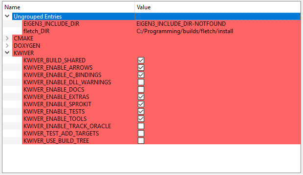

   
Kitware Image and Video Exploitation and Retrieval
==================================================

The KWIVER toolkit is a collection of software tools designed to
tackle challenging image and video analysis problems and other related
challenges. Recently started by Kitware’s Computer Vision and
Scientific Visualization teams, KWIVER is an ongoing effort to
transition technology developed over multiple years to the open source
domain to further research, collaboration, and product development.
KWIVER is a collection of C++ libraries with C and Python bindings
and uses an permissive `BSD License <LICENSE>`_.

One of the primary design goals of KWIVER is to make it easier to pull
together algorithms from a wide variety of third-party, open source
image and video processing projects and integrate them into highly
modular, run-time configurable systems.  This goal is achieved through
the three main components of KWIVER: Vital, Arrows, and Sprokit.

Vital
-----
Vital is core of KWIVER and is designed to provide data and algorithm
abstractions with minimal library dependencies.  Vital only depends on
the C++ standard library and the header-only Eigen_ library.  Vital defines
the core data types and abstract interfaces for core vision algorithms
using these types.  Vital also provides various system utility functions
like logging, plugin management, and configuration file handling.  Vital
does **not** provide implementations of the abstract algorithms.
Implementations are found in Arrows and are loaded dynamically at run-time
via plugins.

The design of KWIVER allows end-user applications to link only against
the Vital libraries and have minimal hard dependencies.  One can then
dynamically add algorithmic capabilities, with new dependencies, via
plugins without needing to recompile Vital or the application code.
Only Vital is built by default when building KWIVER without enabling
any options in CMake.

Arrows
------
Arrows is the collection of plugins that provides implementations of the
algorithms declared in Vital.  Each arrow can be enabled or disabled
in build process through CMake options.  Most arrows bring in additional
third-party dependencies and wrap the capabilities of those libraries
to make them accessible through the Vital APIs.  The code in Arrows
also converts or wrap data types from these external libraries into
Vital data types.  This allows interchange of data between algorithms
from different arrows using Vital types as the intermediary.

Capabilities are currently organized into Arrows based on what third
party library they require.  However, this arrangement is not required
and may change as the number of algorithms and arrows grows.  Some
arrows, like `core <arrows/core>`_, require no additional dependencies.
Some examples of the provided Arrows are:

* `ocv <arrows/ocv>`__ - provides algorithms from OpenCV_
* `ceres <arrows/ceres>`__ - provides algorithms from `Ceres Solver`_
* `vxl <arrow/vxl>`__ - provides algorithms from VXL_

Sprokit
-------
Sprokit is a "**S**\ tream **Pro**\ cessing Tool\ **kit**" that provides
infrastructure for chaining together algorithms into pipelines for
processing streaming data sources.  The most common use case of Sprokit
is for video processing, but Sprokit is data type agnostic and could be
used for any type of streaming data.  Sprokit allows the user to dynamically
connect and configure a pipeline by chaining together processing nodes
called "processes" into a directed graph with data sources and sinks.
Sprokit schedules the jobs to run each process and keep data flowing through
pipeline.  Sprokit also allows processes written in Python to be
interconnected with those written in C++.

Building KWIVER
===============

Fletch
------

KWIVER, especially Arrows, has a number of dependencies on 3rd party
open source libraries.  Most of these dependencies are optional
but useful in practice, and the number of dependencies is expected to
grow as we expand Arrows.  

Vital has minimal required dependencies (only Eigen_).
Sprokit additionally relies on Boost_.
Arrows and Sprokit processes are structured so that
the code that depends on an external package is in a directory with
the major dependency name (e.g. vxl, ocv). The dependencies can be
turned ON or OFF through CMake variables.

To make it easier to build KWIVER, especially
on systems like Microsoft Windows that do not have package manager,
Fletch_ was developed to gather, configure and build dependent packages
for use with KWIVER.  Fletch is a CMake_ based "super-build" that
takes care of most of the build details for you.

For building Fletch_, refer to the README file in that repository.

Running CMake
-------------

You may run cmake directly from a shell or cmd window.
On unix systems, the ccmake tool allows for interactive selection of CMake options.  
Available for all platforms, the CMake GUI can set the source and build directories, options,
"Configure" and "Generate" the build files all with the click of a few button.

We recommend building Fletch out of the source directory to prevent mixing
source files with compiled products.  Create a build directory in parallel
with the Fletch source directory for each desired configuration. For example :

========================== ===================================================================
``\kwiver\src``             contains the code from the git repository
``\kwiver\build\release``   contains the built files for the release configuration
``\kwiver\build\debug``     contains the built files for the debug configuration
========================== ===================================================================

The following are the most important CMake configuration options for KWIVER.

============================= ====================================================================
``CMAKE_BUILD_TYPE``          The compiler mode, usually Debug or Release
``CMAKE_INSTALL_PREFIX``      The path to where you want the kwiver build products to install
``KWIVER_ENABLE_ARROWS``      Enable algorithm implementation plugins
``KWIVER_ENABLE_C_BINDINGS``  Whether to build the Vital C bindings
``KWIVER_ENABLE_DOCS``        Turn on building the Doxygen documentation
``KWIVER_ENABLE_LOG4CPLUS``   Enable log4cplus logger back end
``KWIVER_ENABLE_PYTHON``      Enable the Vital Python bindings (requires KWIVER_ENABLE_C_BINDINGS)
``KWIVER_ENABLE_SPROKIT``     Enable the Stream Processing Toolkit
``KWIVER_ENABLE_TESTS``       Build the unit tests
``KWIVER_ENABLE_TOOLS``       Build the command line tools (e.g. plugin_explorer)
``fletch_DIR``                Install directory of a Fletch build.
============================= ====================================================================

There are many more options.  Specifically, there are numerous options
for third-party projects prefixed with ``KWIVER_ENABLE_`` that enable
building the Arrows plugins that depend on those projects.  When building
with the support of Fletch_ (set ``fletch_DIR``) the enable options for
packages built by Fletch should be turned on by default.

The following sections will walk you through the basic options for a minimal kwiver build.

Basic CMake generation via command line
~~~~~~~~~~~~~~~~~~~~~~~~~~~~~~~~~~~~~~~~~~~~~~~~

Note, This assumes your fletch was built with python support (Turn OFF if not)

You will also need to replace the fletch path with your own::

    $ cmake </path/to/kwiver/source> -DCMAKE_BUILD_TYPE=Release \
            -Dfletch_DIR:PATH=<path/to/fletch/builds/install> 
            -DKWIVER_ENABLE_ARROWS:BOOL=ON -DKWIVER_ENABLE_C_BINDINGS:BOOL=ON \
            -DKWIVER_ENABLE_EXTRAS:BOOL=ON -DKWIVER_ENABLE_LOG4CPLUS:BOOL=ON \
            -DKWIVER_ENABLE_PROCESSES:BOOL=ON -DKWIVER_ENABLE_PYTHON:BOOL=ON \
            -DKWIVER_ENABLE_SPROKIT:BOOL=ON -DKWIVER_ENABLE_TOOLS:BOOL=ON \
            -DKWIVER_USE_BUILD_TREE:BOOL=ON

Basic CMake generation using ccmake
~~~~~~~~~~~~~~~~~~~~~~~~~~~~~~~~~~~~~~~~~~~~

When first configuring a kwiver build with ccmake it is preferable to set the build
configuration and ``fletch_DIR`` on the command line like this::

  $ ccmake /path/to/kwiver/source -DCMAKE_BUILD_TYPE=Release -Dfletch_DIR=/path/to/fletch/install

Other CMake options can also be passed on the command line in this way if desired.
Follow the recommended option setup using the cmake GUI. 

Basic CMake generation using the CMake GUI
~~~~~~~~~~~~~~~~~~~~~~~~~~~~~~~~~~~~~~~~~~~~~~~~~~~

When running the cmake gui, we recommend selecting the 'Grouped' and 'Advanced'
options to better organize the options available. Note, after clicking the
configuration button, new options will be highlighted in the red sections.

1. Once the source code and build directories are set, press the 'Configuration'
   button and select your compiler.

   a. Configuration will fail, but now we can set option values
  
2. Set the fletch_DIR, the CMAKE_BUILD_TYPE, and these KWIVER options,
   and press the 'Configuration' button

   a. Note, if compiling with MSVC, you will not have a CMAKE_BUILD_TYPE option
  

  
3. Select these new options, and click 'Generate'

   a. This assumes your fletch was build with python support,
      if not, do not check that option

.. image:: doc/manuals/images/cmake/cmake_step_3.png
   :alt: KWIVER CMake Configuration Step 3

Compiling
---------

Once your CMake generation has completed and created the build files,
compile in the standard way for your build environment.  On Linux
this is typically running ``make``.

There is also a build target, INSTALL. This target will build all code,
then create an install directory inside the build directory.  This install
folder will be populated with all binaries, libraries, headers, and other files
you will need to develop your application with kwiver.  MSVC users note, this
install directory is for a single build configuration and their will not be configuration 
named directories in this directory structure. (i.e. no /bin/release, only /bin)

Running KWIVER
==============

Once you've built KWIVER, you'll want to test that it's working on your system.
From a command prompt execute the following command::

  # via a bash shell
  source </path/to/kwiver/build>/setup_KWIVER.sh
  #
  # via a windows cmd prompt
  </path/to/kwiver/build>/setup_KWIVER.bat

Where `</path/to/kwiver/build>` is the actual path of your KWIVER
CMake build directory.

This will set up your PATH, PYTHONPATH and other environment variables
to allow KWIVER to work conveniently within in the shell/cmd window.

You can run this simple pipeline to ensure your system is configured properly::

  # via a bash shell
  </path/to/kwiver/build>/bin/pipeline_runner -p </path/to/kwiver/source>/sprokit/pipelines/number_flow.pipe
  #
  # on windows, you will need to also be in the configuration folder
  </path/to/kwiver/build>/bin/release/pipeline_runner -p </path/to/kwiver/source>/sprokit/pipelines/number_flow.pipe

This will generate a 'numbers.txt' file in the current directory (/bin or /bin/release).

KWIVER Users
============

Here are some applications using kwiver that serve as an example of how to
leverage kwiver for a specific application

========== ================================================================
MAP-Tk_    A collection tools for structure-from-motion and dense 3D
           reconstruction from imagery with an emphasis on aerial video.
           The primary component is a GUI application named TeleSculptor.
VIAME_     A computer vision library designed to integrate several image and
           video processing algorithms together in a common distributed
           processing framework, majorly targeting marine species analytics
========== ================================================================

Code Structure and Provided Functionality
=========================================

Below is a summary of the key directories in KWIVER and a brief summary of
the content they contain.

================ ===========================================================
`<CMake>`_       CMake helper scripts
`<arrows>`_      The algorithm plugin modules
`<doc>`_         Documentation, manuals, release notes
`<examples>`_    Examples for running KWIVER (currently out of date)
`<extras>`_      Extra utilities (e.g. instrumentation)
`<sprokit>`_     Stream processing toolkit
`<tests>`_       Testing related support code
`<vital>`_       Core libraries source and headers
================ ===========================================================

Vital
-----

========================= =========================================================
`<vital/algo>`_           Abstract algorithm definitions
`<vital/bindings>`_       C and Python bindings
`<vital/config>`_         Configuration support code
`<vital/exceptions>`_     Exception class hierarchy
`<vital/io>`_             Classes that support reading and writing core data types
`<vital/kwiversys>`_      Code that supports the OS abstraction layer
`<vital/logger>`_         Classes that provide logging support
`<vital/plugin_loader>`_  Classes that provide plugin loading services
`<vital/tests>`_          Unit tests for vital code
`<vital/tools>`_          Source for command line utilities
`<vital/types>`_          Classes for the core data types
`<vital/util>`_           Source for general purpose utility functions
`<vital/video_metadata>`_ Classes that support video metadata
========================= =========================================================

Arrows
------

===================== =========================================================
`<arrows/burnout>`_   [*Experimental*] Pixel classifiers for heads-up display
                      detection an related tasks using Vibrant_.
`<arrows/ceres>`_     Algorithms for bundle adjustment and optimization using
                      `Ceres Solver`_.
`<arrows/core>`_      Algorithms implemented with no additional third party
                      dependencies beyond what Vital uses (Eigen).
`<arrows/darknet>`_   [*Experimental*] Object detection with the Darknet_ YOLO CNN.
`<arrows/matlab>`_    An interface for running Matlab code KWIVER 
`<arrows/ocv>`_       Algorithms implemented using OpenCV_.
                      Includes feature detectors and descriptor, homography
                      and fundamental matrix estimation, image IO, and more.
`<arrows/proj>`_      Geographic conversion functions implemented with PROJ4_.
`<arrows/uuid>`_      [*Experimental*] Implementation of unique IDs using libuuid
`<arrows/viscl>`_     [*Experimental*] Algorithms using VisCL to implement
                      algorithms in OpenCL 
`<arrows/vxl>`_       Algorithms implemnted using the VXL_ libraries.
                      Includes bundle adjustment, homography estimation, video
                      file reading, and more.
===================== =========================================================

Sprokit
-------

====================== =========================================================
`<sprokit/cmake>`_     CMake helper scripts specific to Sprokit
`<sprokit/conf>`_      Configuration files CMake will tailor to the build system
                       machine and directory structure
`<sprokit/doc>`_       Further documenation related to sprokit
`<sprokit/extra>`_     General scripts, hooks, and cofigurations for use with 3rd
                       party tools (e.g. git and vim)
`<sprokit/pipelines>`_ Example pipeline files demonstrating the execution of
                       various arrows through sprokit
`<sprokit/processes>`_ General utility processess that encapsulate various arrows
                       for core funcionality  
`<sprokit/src>`_       Core infrastructure code for defining, chaining, and
                       executing Sprokit processes 
`<sprokit/tests>`_     Sprokit unit tests
====================== =========================================================

Testing
========
Continuous integration testing is provided by CDash_.
Our `KWIVER dashboard <https://open.cdash.org/index.php?project=KWIVER>`_
hosts nightly build and test results across multiple platforms including
Windows, Mac, and Linux.

Anyone can contribute a build to this dashboard using the
`dashboard script <CMake/dashboard-scripts/KWIVER_common.cmake>`_
provided.  Follow the instructions in the comments.

`Travis CI`_ is also used for continued integration testing.
Travis CI is limited to a single platform (Ubuntu Linux), but provides
automated testing of all topic branches and pull requests whenever they are created.

============================= =============
Travis CI **master** branch:  |CI:master|_
Travis CI **release** branch: |CI:release|_
============================= =============

Contributing
============

For details on how to contribute to KWIVER, including code style and branch
naming conventions, please read `<CONTRIBUTING.rst>`_.

Getting Help
============

Please join the
`kwiver-users <http://public.kitware.com/mailman/listinfo/kwiver-users>`_
mailing list to discuss KWIVER or to ask for help with using KWIVER.
For less frequent announcements about KWIVER and projects built on KWIVER,
please join the
`kwiver-announce <http://public.kitware.com/mailman/listinfo/kwiver-announce>`_
mailing list.

Acknowledgements
================

The authors would like to thank AFRL/Sensors Directorate for their support
of this work via SBIR Contract FA8650-14-C-1820. The portions of this work
funded by the above contract are approved for public release via case number
88ABW-2017-2725.

The authors would like to thank IARPA for their support of this work via the
DIVA program.

The authors would like to thank NOAA for their support of this work via the
NOAA Fisheries Strategic Initiative on Automated Image Analysis.

.. Appendix I: References
.. ======================

.. _Boost: http://www.boost.org/
.. _`Ceres Solver`: http://ceres-solver.org/
.. _CDash: http://www.cdash.org/
.. _CMake: http://www.cmake.org/
.. _Darknet: https://pjreddie.com/darknet/yolo/
.. _Eigen: http://eigen.tuxfamily.org/
.. _Fletch: https://github.com/Kitware/fletch
.. _Kitware: http://www.kitware.com/
.. _MAP-Tk: https://github.com/Kitware/maptk
.. _OpenCV: http://opencv.org/
.. _PROJ4: http://proj4.org/
.. _Travis CI: https://travis-ci.org/
.. _VIAME: https://github.com/Kitware/VIAME
.. _Vibrant: https://github.com/Kitware/vibrant
.. _VXL: https://github.com/vxl/vxl/

.. Appendix II: Text Substitutions
.. ===============================

.. |>=| unicode:: U+02265 .. greater or equal sign

.. |CI:master| image:: https://travis-ci.org/Kitware/kwiver.svg?branch=master
.. |CI:release| image:: https://travis-ci.org/Kitware/kwiver.svg?branch=release

.. _CI:master: https://travis-ci.org/Kitware/kwiver
.. _CI:release: https://travis-ci.org/Kitware/kwiver
