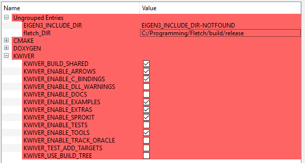
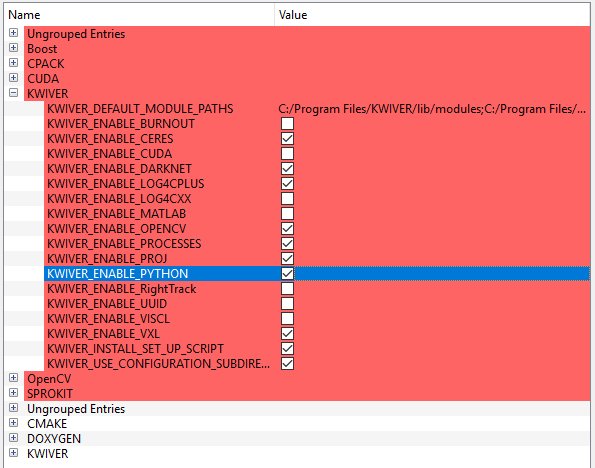

.. image:: doc/kwiver_Logo-300x78.png
   :alt: KWIVER

|master|   |release|   |version|   |docker|

.. |master| image:: https://img.shields.io/travis/Kitware/kwiver/master?label=master
.. |release| image:: https://img.shields.io/travis/Kitware/kwiver/release?label=release
.. |version| image:: https://img.shields.io/github/release/kitware/kwiver
.. |docker| image:: https://img.shields.io/docker/pulls/kitware/kwiver

Kitware Image and Video Exploitation and Retrieval
==================================================

The KWIVER toolkit is a collection of software tools designed to
tackle challenging image and video analysis problems and other related
challenges. Recently started by Kitware’s Computer Vision and
Scientific Visualization teams, KWIVER is an ongoing effort to
transition technology developed over multiple years to the open source
domain to further research, collaboration, and product development.
KWIVER is a collection of C++ libraries with C and Python bindings
and uses an permissive `BSD License <LICENSE>`_.

One of the primary design goals of KWIVER is to make it easier to pull
together algorithms from a wide variety of third-party, open source
image and video processing projects and integrate them into highly
modular, run-time configurable systems.

For more information on how KWIVER achieves this goal,
and how to use KWIVER visit our `documentation site <http://kwiver.readthedocs.io/en/latest/>`_

Directory Structure and Provided Functionality
==============================================

Below is a summary of the key directories in KWIVER and a brief summary of
the content they contain.

================ ===========================================================
`<CMake>`_       CMake helper scripts
`<arrows>`_      The algorithm plugin modules
`<doc>`_         Documentation, manuals, release notes
`<examples>`_    Examples for running KWIVER (currently out of date)
`<extras>`_      Extra utilities (e.g. instrumentation)
`<sprokit>`_     Stream processing toolkit
`<tests>`_       Testing related support code
`<vital>`_       Core libraries source and headers
================ ===========================================================

KWIVER Docker Image
=============================

Kitware maintains a `Docker <https://www.docker.com/>`_ image with KWIVER prebuilt.
The Dockerfile used to build the image can be found `here <dockerfile>`_.

Pull the image from Dockerhub::

 "docker pull kitware/kwiver:master" (latest master)

 "docker pull kitware/kwiver:release" (latest release)

 "docker pull kitware/kwiver:1.5.0" (static release)

(`https://hub.docker.com/r/kitware/kwiver <https://hub.docker.com/r/kitware/kwiver>`_)

or build the KWIVER image using the dockerfile::

 "docker build -t kwiver:tagname ."

Building KWIVER
===============

Fletch
------

KWIVER, especially Arrows, has a number of dependencies on 3rd party
open source libraries.  Most of these dependencies are optional
but useful in practice, and the number of dependencies is expected to
grow as we expand Arrows.

Vital has minimal required dependencies (only Eigen_).
Sprokit additionally relies on Boost_.
C++ tests additionally rely on `Google Test`_.
Arrows and Sprokit processes are structured so that
the code that depends on an external package is in a directory with
the major dependency name (e.g. vxl, ocv). The dependencies can be
turned ON or OFF through CMake variables.

To make it easier to build KWIVER, especially
on systems like Microsoft Windows that do not have package manager,
Fletch_ was developed to gather, configure and build dependent packages
for use with KWIVER.  Fletch is a |cmake_link|_ based
"super-build" that takes care of most of the build details for you.

For building Fletch_, refer to the README file in that repository.

Running CMake
-------------

You may run cmake directly from a shell or cmd window.
On unix systems, the ccmake tool allows for interactive selection of CMake options.
Available for all platforms, the CMake GUI can set the source and build directories, options,
"Configure" and "Generate" the build files all with the click of a few button.

We recommend building KWIVER out of the source directory to prevent mixing
source files with compiled products.  Create a build directory in parallel
with the KWIVER source directory for each desired configuration. For example :

========================== ===================================================================
``\kwiver\src``             contains the code from the git repository
``\kwiver\build\release``   contains the built files for the release configuration
``\kwiver\build\debug``     contains the built files for the debug configuration
========================== ===================================================================

The following are the most important CMake configuration options for KWIVER.

============================= ====================================================================
``CMAKE_BUILD_TYPE``          The compiler mode, usually Debug or Release
``CMAKE_INSTALL_PREFIX``      The path to where you want the kwiver build products to install
``KWIVER_ENABLE_ARROWS``      Enable algorithm implementation plugins
``KWIVER_ENABLE_C_BINDINGS``  Whether to build the Vital C bindings
``KWIVER_ENABLE_DOCS``        Turn on building the Doxygen documentation
``KWIVER_ENABLE_LOG4CPLUS``   Enable log4cplus logger back end
``KWIVER_ENABLE_PYTHON``      Enable the Vital Python bindings (requires KWIVER_ENABLE_C_BINDINGS)
``KWIVER_ENABLE_SPROKIT``     Enable the Stream Processing Toolkit
``KWIVER_ENABLE_TESTS``       Build the unit tests (requires Google Test)
``KWIVER_ENABLE_TOOLS``       Build the command line tools (e.g. plugin_explorer)
``fletch_DIR``                Install directory of a Fletch build.
============================= ====================================================================

There are many more options.  Specifically, there are numerous options
for third-party projects prefixed with ``KWIVER_ENABLE_`` that enable
building the Arrows plugins that depend on those projects.  When building
with the support of Fletch_ (set ``fletch_DIR``) the enable options for
packages built by Fletch should be turned on by default.
The fletch_DIR is the fletch build directory root, which contains the fletchConfig.cmake file.

The following sections will walk you through the basic options for a minimal kwiver build.

Basic CMake generation via command line
~~~~~~~~~~~~~~~~~~~~~~~~~~~~~~~~~~~~~~~~~~~~~~~~

Note, This assumes your fletch was built with python support (Turn OFF if not)

You will also need to replace the fletch path with your own::

    $ cmake </path/to/kwiver/source> -DCMAKE_BUILD_TYPE=Release \
            -Dfletch_DIR:PATH=<path/to/fletch/build/dir> \
            -DKWIVER_ENABLE_ARROWS:BOOL=ON -DKWIVER_ENABLE_C_BINDINGS:BOOL=ON \
            -DKWIVER_ENABLE_EXTRAS:BOOL=ON -DKWIVER_ENABLE_LOG4CPLUS:BOOL=ON \
            -DKWIVER_ENABLE_PROCESSES:BOOL=ON -DKWIVER_ENABLE_PYTHON:BOOL=ON \
            -DKWIVER_ENABLE_SPROKIT:BOOL=ON -DKWIVER_ENABLE_TOOLS:BOOL=ON \
            -DKWIVER_ENABLE_EXAMPLES:BOOL=ON -DKWIVER_USE_BUILD_TREE:BOOL=ON

Basic CMake generation using ccmake
~~~~~~~~~~~~~~~~~~~~~~~~~~~~~~~~~~~~~~~~~~~~

When first configuring a kwiver build with ccmake it is preferable to set the build
configuration and ``fletch_DIR`` on the command line like this::

  $ ccmake /path/to/kwiver/source -DCMAKE_BUILD_TYPE=Release -Dfletch_DIR=/path/to/fletch/install

Other CMake options can also be passed on the command line in this way if desired.
Follow the recommended option setup using the cmake GUI.

Basic CMake generation using the CMake GUI
~~~~~~~~~~~~~~~~~~~~~~~~~~~~~~~~~~~~~~~~~~~~~~~~~~~

When running the cmake gui, we recommend selecting the 'Grouped' and 'Advanced'
options to better organize the options available. Note, after clicking the
configuration button, new options will be highlighted in the red sections.

1. Once the source code and build directories are set, press the 'Configuration'
   button and select your compiler.

   a. Configuration will fail, but now we can set option values

2. Set the fletch_DIR, the CMAKE_BUILD_TYPE, and these KWIVER options,
   and press the 'Configuration' button

   a. Note, if compiling with MSVC, you will not have a CMAKE_BUILD_TYPE option

3. Select these new options, and click 'Generate'

   a. This assumes your fletch was build with python support,
      if not, do not check that option

Compiling
---------

Once your CMake generation has completed and created the build files,
compile in the standard way for your build environment.  On Linux
this is typically running ``make``.

There is also a build target, INSTALL. This target will build all code,
then create an install directory inside the build directory.  This install
folder will be populated with all binaries, libraries, headers, and other files
you will need to develop your application with kwiver. MSVC users, note that
this install directory is for a single build configuration; there will not be
configuration named directories in this directory structure
(i.e. no ``/bin/release``, only ``/bin``).

.. note::

  If you are on Windows and enable tests (``KWIVER_ENABLE_TESTS=ON``),
  and are building shared libraries (``BUILD_SHARED_LIBS=ON``), you will
  need to add the path to ``gtest.dll`` to the ``PATH`` in your environment
  in order to build and run the tests.

  The easiest way to achieve this is to use the ``setup_KWIVER.bat`` script
  (described in the next session), and to run builds and/or launch Visual
  Studio from a command prompt which has been so configured.

Running KWIVER
==============

Once you've built KWIVER, you'll want to test that it's working on your system.
Change your terminal/command prompt to the KWIVER CMake build directory.
From a command prompt execute the following command::

  # via a bash shell
  $ cd <path/to/kwiver/build>
  $ source setup_KWIVER.sh
  #
  # via a windows cmd prompt
  > cd <path/to/kwiver/build>
  > setup_KWIVER.bat

This will set up your PATH, PYTHONPATH and other environment variables
to allow KWIVER to work conveniently within in the shell/cmd window.

You can run this simple pipeline to ensure your system is configured properly::

  # via a bash shell
  $ cd bin
  $ kwiver runner ../examples/pipelines/number_flow.pipe
  #
  # on windows, you will need to also be in the configuration folder
  > cd bin\release
  > kwiver runner ..\..\examples\pipelines\number_flow.pipe

This will generate a 'numbers.txt' file in the </path/to/kwiver/build>/examples/pipelines/output directory.

More examples can be found in our `tutorials <http://kwiver.readthedocs.io/en/latest/tutorials.html>`_

KWIVER Users
============

Here are some applications using kwiver that serve as an example of how to
leverage kwiver for a specific application

========== ================================================================
MAP-Tk_    A collection tools for structure-from-motion and dense 3D
           reconstruction from imagery with an emphasis on aerial video.
           The primary component is a GUI application named TeleSculptor.
VIAME_     A computer vision library designed to integrate several image and
           video processing algorithms together in a common distributed
           processing framework, majorly targeting marine species analytics
========== ================================================================

Testing
========
Continuous integration testing is provided by CDash_.
Our `KWIVER dashboard <https://open.cdash.org/index.php?project=KWIVER>`_
hosts nightly build and test results across multiple platforms including
Windows, Mac, and Linux.

Anyone can contribute a build to this dashboard using the
`dashboard script <CMake/dashboard-scripts/KWIVER_common.cmake>`_
provided.  Follow the instructions in the comments.

Contributing
============

For details on how to contribute to KWIVER, including code style and branch
naming conventions, please read `<CONTRIBUTING.rst>`_.

Getting Help
============

Please join the
`kwiver-users <http://public.kitware.com/mailman/listinfo/kwiver-users>`_
mailing list to discuss KWIVER or to ask for help with using KWIVER.
For less frequent announcements about KWIVER and projects built on KWIVER,
please join the
`kwiver-announce <http://public.kitware.com/mailman/listinfo/kwiver-announce>`_
mailing list.

Acknowledgements
================

The authors would like to thank AFRL/Sensors Directorate for their support
of this work via SBIR Contract FA8650-14-C-1820. The portions of this work
funded by the above contract are approved for public release via case number
88ABW-2017-2725.

The authors would like to thank IARPA for their support of this work via the
DIVA program.

The authors would like to thank NOAA for their support of this work via the
NOAA Fisheries Strategic Initiative on Automated Image Analysis.

.. Appendix I: References
.. ======================

.. _Boost: http://www.boost.org/
.. _`Ceres Solver`: http://ceres-solver.org/
.. _CDash: http://www.cdash.org/
.. _cmake_link: http://www.cmake.org/
.. _Darknet: https://pjreddie.com/darknet/yolo/
.. _Eigen: http://eigen.tuxfamily.org/
.. _Fletch: https://github.com/Kitware/fletch
.. _Google Test: https://github.com/google/googletest
.. _Kitware: http://www.kitware.com/
.. _MAP-Tk: https://github.com/Kitware/maptk
.. _OpenCV: http://opencv.org/
.. _PROJ4: http://proj4.org/
.. _Travis CI: https://travis-ci.org/
.. _VIAME: https://github.com/Kitware/VIAME
.. _Vibrant: https://github.com/Kitware/vibrant
.. _VXL: https://github.com/vxl/vxl/

.. Appendix II: Text Substitutions
.. ===============================

.. Use a different target name to avoid conflict with `<CMake>`_ link to the
   source tree.

.. |cmake_link| replace:: CMake

.. |>=| unicode:: U+02265 .. greater or equal sign
