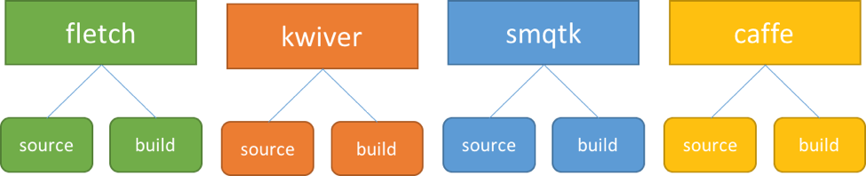

SMQTK/C++ Bridge
================

The SMQTK C++ Bridge is a mechanism that allows C++ based programs
to make calls to the Python based SMQTK project.  In particular,
it allows a C++ program to call the SMQTK descriptor engine by
providing an image as input and receiving a feature vector in return.

The bridge is based on Kitware’s KWIVER project.  In particular it
uses the data types and core services provided by KWIVER’s VITAL
project and the pipeline processing (including Python compute nodes)
provided by SMQTK’s Sprokit project. The :ref:`smqtkcplusplusbridgeblock` shows
the structure of the solution.

.. _smqtkcplusplusbridgeblock:
.. figure:: _images/smqtkcplusplusbridge.png
   :align: center

   *Block Diagramm of the SMQTK/C++ Bridge*

The KWIVER repository and its associated build framework takes care
of building VITAL and Sprokit once it’s properly configured.  Also,
in order to build KWIVER, you must build some of the third party
dependencies maintained by Kitware’s Fletch project ( a repository
that is used to manage the build of a variety of computer vision
and machine learning tools).

This document will help you configure Fletch and KWIVER so that you
can use them with SMQTK and Python.  It will also discuss the
C++/SMQTK bridge and how you can integrate it into your projects.

The instructions assume that you will set up a directory structure
similar to the :ref:`smqtkbridgesourceorganiziation` shown.

.. _smqtkbridgesourceorganiziation:

   *SMQTK/C++ Bridge Source Organization*

These projects are interdependent, so you’ll want to fetch the
repositories and checkout the correct branch for all of them first.

Getting the Code
----------------

Fletch
++++++

In the Fletch directory::

    git clone https://github.com/Kitware/fletch.git source
    cd source
    git checkout master

KWIVER
++++++

In the KWIVER directory::

    git clone https://github.com/kitware/kwiver.git source
    cd source
    git checkout master

SMQTK
+++++

In the SMQTK directory::

    git clone https://github.com/Kitware/SMQTK.git source
    cd source
    git checkout v0.2

CAFFE
+++++

In the CAFFE directory::

    git clone https://github.com/BVLC/caffe.git source
    cd source
    git checkout rc2
    ./scripts/download_model_binary.py models/bvlc_reference_caffenet
    ./data/ilsvrc12/get_ilsvrc_aux.sh

For CAFFE, in addition to obtaining the source code, we're fetching
some pre-trained models that we can use.

Setting up a Python Environment
-------------------------------

In order to use the SMQTK/C++ bridge, you must have a Python
environment on your system.  We recommend installing the Miniconda_
environment from Continuum_ -- an open source Python environment
that makes it very easy to set up Python for scientific computing.

.. _Miniconda: http://conda.pydata.org/miniconda.html
.. _Continuum: https://www.continuum.io/

Make sure that the Miniconda python command is the first one in
your PATH::

    export PATH=~/.miniconda/bin:${PATH}

We will also need to create an SMQTK conda environment in which we will run SMQTK::

    conda create -n smqtk --file smqtk/source/requirements.conda.txt
    source activate smqtk
    pip install -r smqtk/source/requirements.pip.txt
    pip install scikit-image
    pip install protobuf

Building the Code
-----------------

Fletch
++++++

.. note::
    It is important that only the Miniconda environment (and not
    the smqtk environment is active when building fletch.  Run ``source
    deactivate`` to be sure.)

From your Fletch directory::

    mkdir build
    cd build
    cmake -C ../source/sprokit/processes/examples/call_SMQTK_pipeline/fletch-precache.cmake ../source/

This will configure Fletch to build the projects that KWIVER needs to
build properly for use with SMQTK/C++ bridge.

To actually build Fletch execute the command::

    cmake --build .

(Note that there is period (``.``) at the end of that command)

KWIVER
++++++

.. note::
    It is important that the SMQTK Miniconda environment
    is active when building fletch.  Run ``source
    activate smqtk`` to be sure.

What follows are the steps required to build KIWVER to provide the SMQTK/C++ bridge

In the KWIVER directory::

    source activate smqtk
    mkdir build
    cd build

To configure the build::

    cmake -Dfletch_DIR:PATH=../../fletch/build/ -C ../source/sprokit/processes/examples/call_SMQTK_pipeline/kwiver-precache.cmake ../source/

Verify that the PYTHON specifications are correct (assuming you installed miniconda in ~/miniconda)::

    PYTHON_EXECUTABLE           ~/miniconda/bin/python
    PYTHON_INCLUDE_DIR          ~/miniconda/include/python2.7
    PYTHON_LIBRARY              ~/miniconda/lib/libpython2.7.so

And finally, build KWIVER::

    make
    make install

CAFFE
+++++

One of the feature's of SMQTK is that it can use a CAFFE based CNNN as
a descriptor.  In general, you simply need to build CAFFE with it's
Python bindings turned on::

    mkdir build
    cd build
    cmake -DBOOST_ROOT:PATH=../../fletch/build/install/  -DOpenCV_DIR:PATH=../../fletch/build/install/share/OpenCV/ ../source/
    make
    make install

SMQTK
+++++

From the SMQTK directory::

    mkdir build
    cd build
    cmake ../source

.. _smqtkbridgetesting:

Testing the Code
----------------

Set your PATH to include the new projects. The following commands will
set the environment so the examples can be run::

    source kwiver/build/install/setup_KWIVER.sh
    source smqtk/build/setup_env.build.sh
    export PYTHONPATH=${PWD}/caffe/build/install/python:${PYTHONPATH}

To test that the the SMQTK/C++ bridge is working, we will run the
SMQTK_Descriptor_test application.  This application is an example
C++ application that accepts a configuration file to specify the
location of your CAFFE installation model, files and GPU configuration
and a single image or list of images and submit that image (or
images) to SMQTK to have CAFFE compute the descriptor.  The application
does nothing with the descriptor other than print the first 50
elements.  This is a sample program only.  You may wish to read the
source code for the program in ``kwiver/source/examples/call_SMQTK_pipeline``
to see how you can adapt this technique to your own programs.

To use the application, you'll need to provide it with a configuration file that tells it what
descriptor to use.

Here is an example configuration file that uses SMQTK's
CaffeDesriptorGenerator to run the ImageNet CNN and  use the 7th
layer as a descriptor::

    {
            "CaffeDescriptorGenerator": {
            "batch_size": 256,
            "data_layer": "data",
            "gpu_device_id": 0,
            "image_mean_filepath": "/path/to/caffe/source/data/ilsvrc12/imagenet_mean.binaryproto",
            "load_truncated_images": true,
            "network_is_bgr": true,
            "network_model_filepath": "/path/to/caffe/source/models/bvlc_reference_caffenet/bvlc_reference_caffenet.caffemodel",
            "network_prototxt_filepath": "/path/to/caffe/source/models/bvlc_reference_caffenet/deploy.prototxt",
            "return_layer": "fc7",
            "use_gpu": false
            },
    "type": "CaffeDescriptorGenerator"
    }

The command to run the test application is as follows (all one line, run from the kwiver/build directory):

    LD_PRELOAD=~/miniconda/envs/smqtk/lib/libpython2.7.so.1.0 ./examples/call_SMQTK_pipeline/SMQTK_Descriptor_test my-caffe-config ../source/examples/cat.jpg

.. note:: The “LD_PRELOAD” variable setting is required to make sure that sprokit does not try to use the system
   python instead of the SMQTK python environment you created.  We will be working to make this unecessary as soon as possible.

When the application runs, it will eventually print out lines that look like this (after many log messages)::

    Descriptor size: 4096
    0 0 0 0 0 0 3.53588 0 0 0 0 3.3475 0 0 0 0 1.67483 0 0 0 0 0 0 0 0 7.86536 0 0 0 0 0 0 0 0 0 0 0 0 0 0 0 0 0 0 0 0 0 0 0 0

Which represents the first 50 elements of the returned feature
vector.  If all of the elements are the value ``0.223``, then
something went wrong and the feature vector was not run

If you wish to use a different model, say AlexNet_, make sure you run
``./scripts/download_model_binary.py models/bvlc_alexnet`` in the
Caffe source directory and then you can create a different
configuration file that specifies
``/path/to/caffe/source/models/bvlc_alexnet/bvlc_alexnet.caffemodel``
for ``network_model_filepath`` and
``/path/to/caffe/source/models/bvlc_alexnet/deploy.prototxt`` for
``network_prototxt_filepath``.

.. _AlexNet: https://github.com/BVLC/caffe/tree/master/models/bvlc_alexnet

Using the SMQTK/C++ Bridge in Your Code
---------------------------------------

The C++ interface to SMQTK descriptors is through the SMQTK_Descriptor
class as defined in the include file ``SMQTK_Descriptor.h``.

The SMQTK descriptor API is built as part of kwiver and is available
in the library ``libSMQTK_Descriptor.so``.  You will need to add this
to your build instructions as ``-lSMQTK_Descriptor`` or in an
equivalent manner appropriate for your build system.

The class provides a single method to apply the descriptor to an image
and return the descriptor vector, which is described as follows:

.. code-block:: c++

    std::vector< double > ExtractSMQTK(  cv::Mat cv_img, std::string const& config_file );

*cv_img*
    An image in OpenCV format

*config_file*
    The name of the SMQTK descriptor configuration file in JSON format.  See :ref:`Testing the Code <smqtkbridgetesting>` for details.

The ExtractSMQTK() method is synchronous in that it will return with
the descriptor vector even though the descriptor calculation may be
multi-threaded.

The source code for the ``call_SMQTK_pipeline`` provides an example of how to use this call in your own programs:

.. literalinclude:: /../../sprokit/processes/examples/call_SMQTK_pipeline/SMQTK_Descriptor_test.cxx
   :language: c++
   :lines: 31-71
   :emphasize-lines: 27
   :linenos:

Include the file SMQTK_Descriptor.h in the source code to get the
interface to the SMQTK_Descriptor class, as shown below::

    #include "SMQTK_Descriptor.h"

The following two source statements implement and apply the descriptor::

    kwiver::SMQTK_Descriptor des; // Create object
    std::vector< double > results = des.ExtractSMQTK( img, file_name );

The inputs are the OpenCV format image and the name of the descriptor
configuration file. The output is the descriptor vector of doubles.

A sample program is provided in the source file SMQTK_Descriptor_test.cxx
which serves as a test of the API and an example of how it is used.
The operation of this test program is discussed above.
