.. VIAME documentation master file
   You can adapt this file completely to your liking, but it should at least
   contain the root `toctree` directive.

.. rst-class:: hidden-title

VIAME
=====

Video and Image Analytics for Multiple Environments (`VIAME`_) is a computer vision application
designed for do-it-yourself artificial intelligence including object detection, object tracking,
data annotation, multi-camera processing, size measurement, image enhancement, rapid model
generation, query-based search, mosaicing, and tools for the evaluation of algorithms. Originally
targeting marine species analytics, VIAME now contains many algorithms and libraries, and is
useful as a generic computer vision toolkit. It contains a number of tools for accomplishing the
above, a pipeline framework which can connect C++/Python nodes in a multi-threaded fashion, and
multiple algorithms resting on top of the pipeline infrastructure. Lastly, a portion of the
algorithms have been integrated into both desktop and web user interfaces for deployments in
different environments, with an open annotation archive and example of the web platform
available at `viame.kitware.com`_.

.. _VIAME: https://www.viametoolkit.org
.. _viame.kitware.com: https://viame.kitware.com

Documentation Overview
======================

This manual is synced to the VIAME `"main"`_ branch and is updated frequently, though you
may have to press ctrl-F5 to see the latest updates to avoid using your browser cache of
this webpage if you have used it previously. In addition to this manual, there are 4 useful
types of documentation:

.. _"main": https://github.com/VIAME/VIAME

1) A `quick-start guide`_ meant for first time users using the desktop version
2) An `overview presentation`_ covering the basic design of VIAME
3) The `VIAME Web and DIVE Desktop docs`_ and in-GUI help menu
4) Our `YouTube video channel`_ (work in progress)

.. _quick-start guide: https://viame.github.io/VIAME/sections/quick_start_guide.html
.. _overview presentation: https://www.viametoolkit.org/wp-content/uploads/2020/09/VIAME-AI-Workshop-Aug2020.pdf
.. _VIAME Web and DIVE Desktop docs: https://kitware.github.io/dive
.. _YouTube video channel: https://www.youtube.com/channel/UCpfxPoR5cNyQFLmqlrxyKJw

Example Capabilities
====================

There are a number of core capabilities within the software, click on each of the below images to learn more.

Object Detection and Tracking

.. image:: _static/images/Text-Query-Result1.jpg
   :alt: Text query result
   :width: 27.5%
   :target: https://github.com/VIAME/VIAME/tree/main/examples/object_tracking

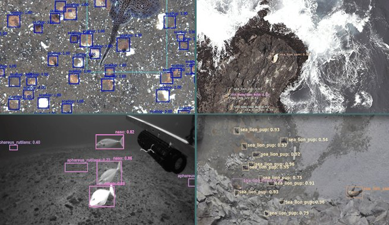

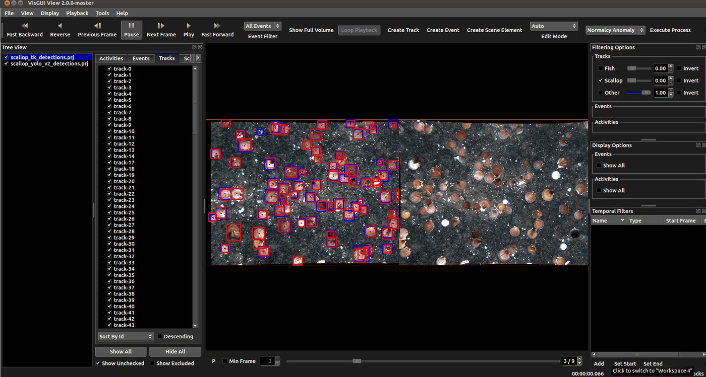

User Interfaces for Annotation, Visualization, and Detector Model Training

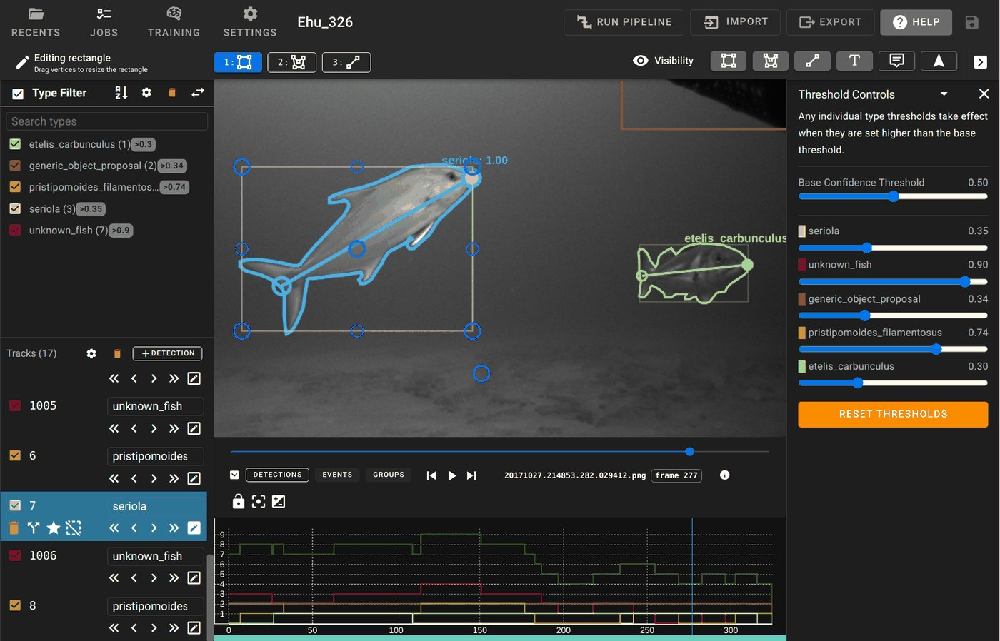

.. image:: _static/images/Point-Segmentation.jpg
   :alt: Point segmentation
   :width: 29%
   :target: https://github.com/VIAME/VIAME/tree/main/examples/user_interfaces

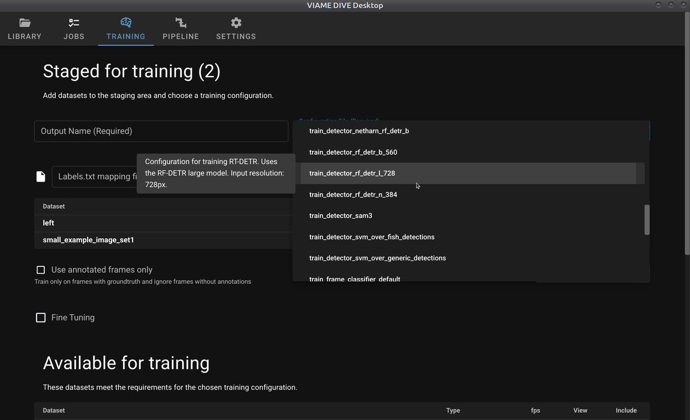

Measuring Animal Lengths Using Metadata or Stereo

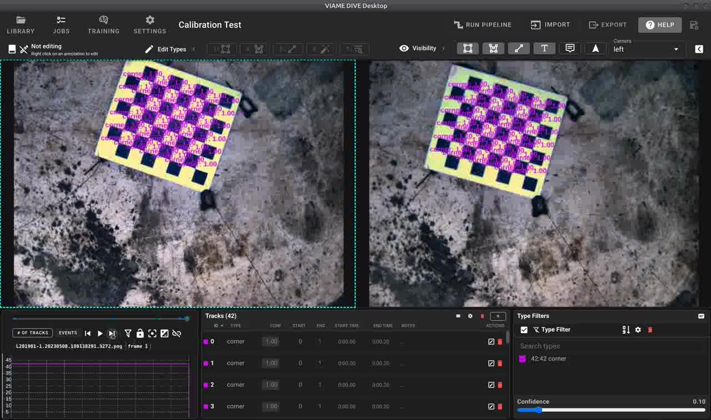

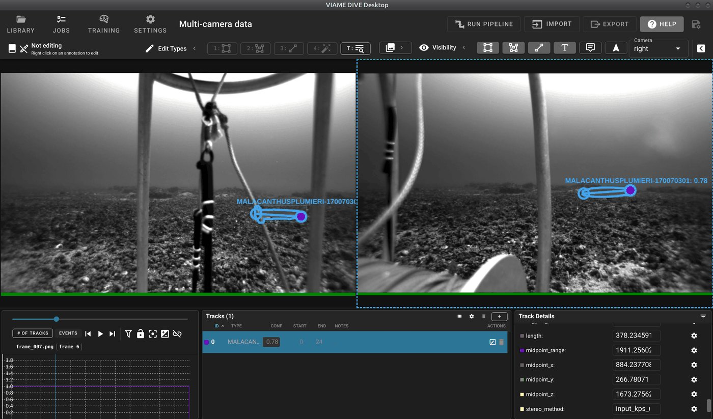

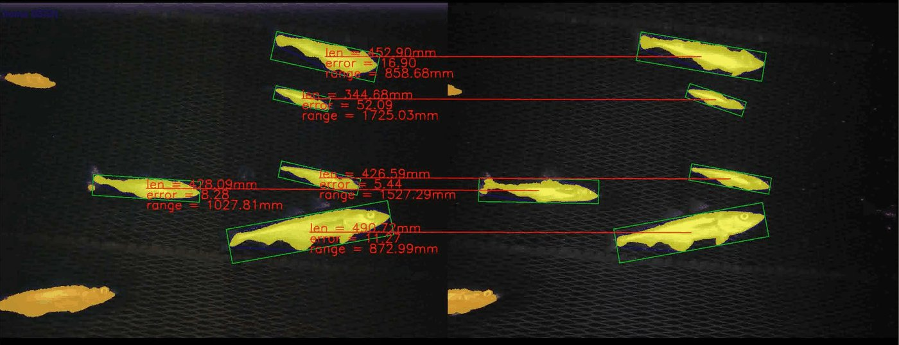

Text, Image, Video Search for Rapid Model Generation

.. image:: _static/images/Perform-Text-Query.jpg
   :alt: Perform text query
   :width: 29%
   :target: https://github.com/VIAME/VIAME/tree/main/examples/video_and_image_search

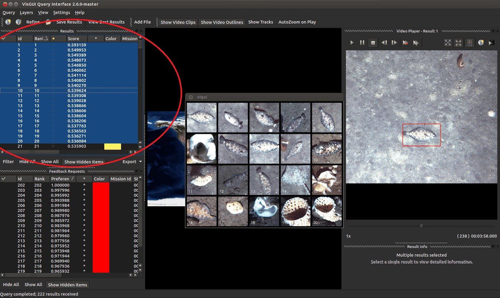

Illumination Normalization and Color Correction

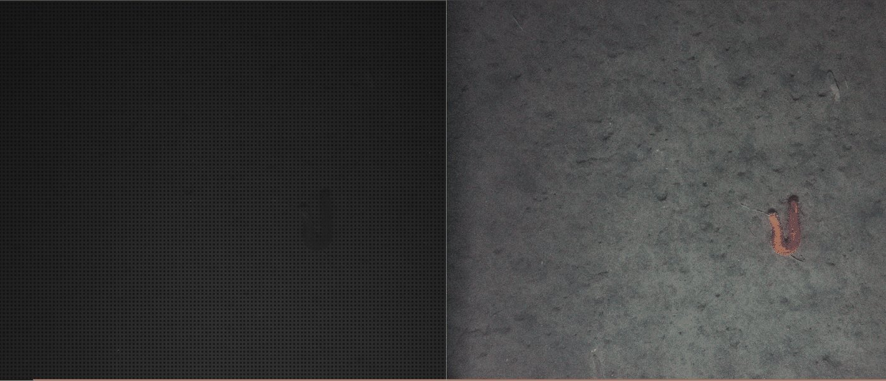

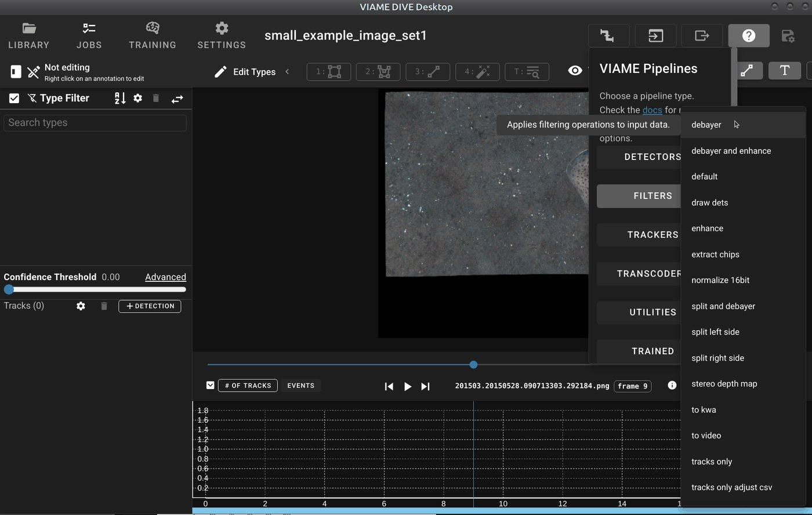

Detector and Tracker Evaluation

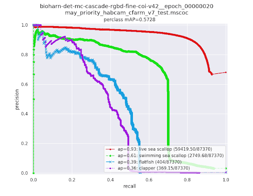

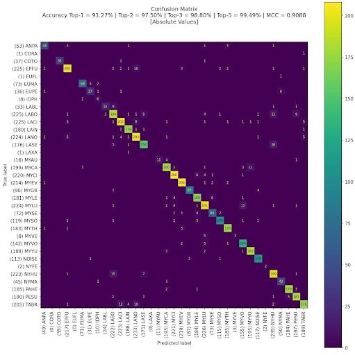

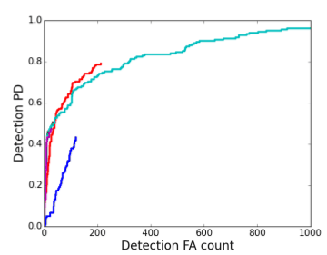

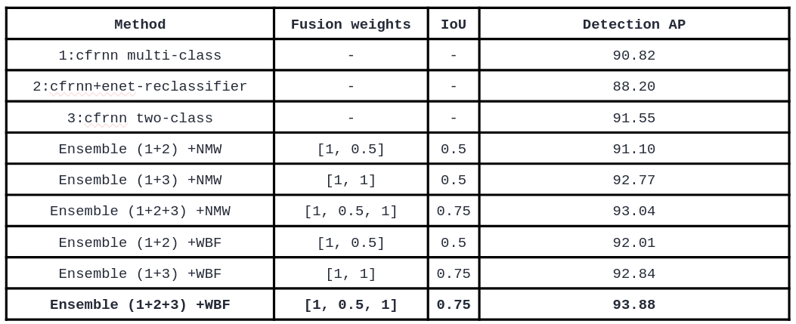

.. |br| raw:: html

    

Contents
========

.. toctree::
   :maxdepth: 1

   Documentation Overview <https://viame.github.io/VIAME/index.html>
   sections/quick_start_guide
   sections/installing_from_binaries
   sections/building_from_source
   sections/model_generation_workflows
   Model Zoo and Add-Ons <https://github.com/VIAME/VIAME/wiki/Model-Zoo-and-Add-Ons>
   sections/user_interfaces
   DIVE Interface <sections/dive/index>
   Python Interface <sections/python_interface>
   sections/project_folders
   sections/examples_overview
   sections/command_line_interface
   sections/detection_file_formats
   sections/detection_file_conversions
   sections/object_detection
   sections/object_detector_training
   Config File Guide <https://github.com/VIAME/VIAME/wiki/Config-Layout-and-Frameworks>
   sections/stereo_measurement
   sections/monocular_measurement
   sections/object_tracking
   sections/image_enhancement
   sections/interactive_annotation
   sections/search_and_rapid_model_generation
   sections/text_query_and_vlm
   sections/scoring_and_evaluation
   sections/registration_and_mosaicing
   sections/frame_level_classification
   sections/scene_segmentation
   sections/archive_summarization
   Core C++/Python Object Types <https://kwiver.readthedocs.io/en/latest/vital/architecture.html>
   Core Pipelining Architecture <https://kwiver.readthedocs.io/en/latest/sprokit/architecture.html>
   Basic Pipeline Nodes <https://kwiver.readthedocs.io/en/latest/arrows/architecture.html>
   sections/example_pipeline
   sections/plugin_creation
   sections/using_algorithms_in_code
   KWIVER Full Manual <https://kwiver.readthedocs.io/en/latest/>
   sections/view_interface
