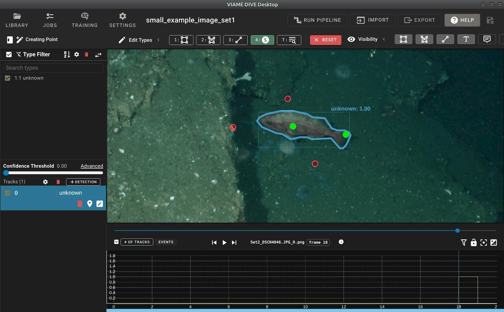
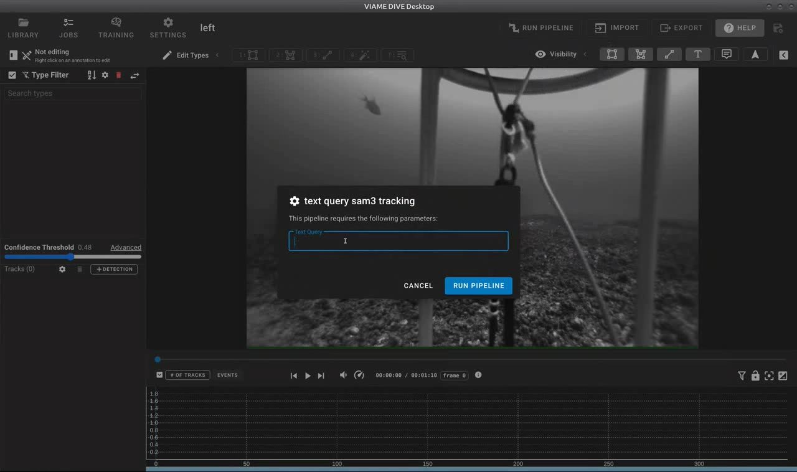
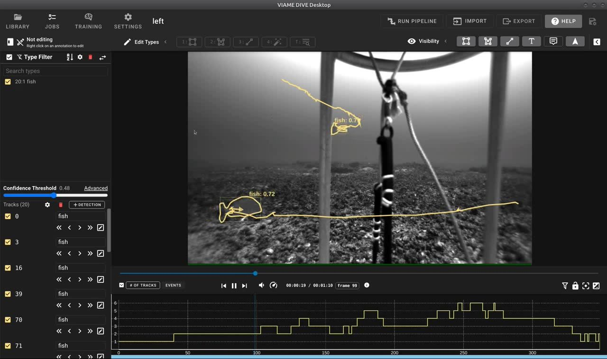

======================
Interactive Annotation
======================

DIVE can segment an object from a few clicks, or from a description in words, in place of
drawing its outline by hand. This page covers the segmentation models VIAME provides for it;
using the tools in the interface is covered by the `DIVE interactive annotation
<https://viame.github.io/VIAME/sections/dive/Interactive-Annotation.html>`__ page, and measuring between a stereo pair of cameras
by `stereo measurement <https://viame.github.io/VIAME/sections/stereo_measurement.html>`__.

************************
Interactive Segmentation
************************

DIVE provides interactive segmentation, allowing users to click on objects (foreground
and background points) to generate segmentation masks in real time. The segmentation
service is started automatically by DIVE based on the configured segmenter in the DIVE
settings. Several segmentation backends are available:

**Watershed (default)**
  Uses OpenCV's watershed algorithm for point-based segmentation. Users provide
  foreground points (marking the object) and background points (marking areas to
  exclude). This is the lightest-weight option and does not require a GPU or any
  add-ons. Works best for objects with clear color boundaries.

**SAM2 (SAM2 add-on)**
  Uses Meta's SAM2 (Segment Anything Model 2) for point-based segmentation. Provides
  significantly better segmentation quality than watershed, especially for complex
  object boundaries. Requires less system resources than SAM3 but lacks the ability
  to perform text queries. Requires a GPU and the SAM2 add-on.

**SAM3 (SAM3 add-on)**
  Uses SAM3 for both point-based and text-based segmentation. In addition to
  click-based segmentation, users can type a text description of the object to segment
  (e.g., "fish", "scallop"). Requires a GPU and the SAM3 add-on. This is the most
  capable interactive segmentation option.

*Point-based interactive segmentation in DIVE. The user clicks foreground (green) and
background (red) points to generate a segmentation mask around the object.*

|

Text queries can also be run as batch pipelines to detect, segment, and track objects
across entire image sets or videos. See `text query and VLM`_ for details.

*SAM3 text query dialog in DIVE. Users enter a text description of the object to detect
and track across the video.*

|

*Results of a SAM3 text query showing automatically detected and tracked fish with
segmentation outlines.*

.. _text query and VLM: https://viame.github.io/VIAME/sections/text_query_and_vlm.html

To manually start the interactive segmentation service outside of DIVE (e.g., for
scripting or integration with other tools)::

  source /path/to/VIAME/install/setup_viame.sh
  python -m viame.core.interactive_segmentation \
    --config configs/pipelines/interactive_segmenter_watershed.conf
