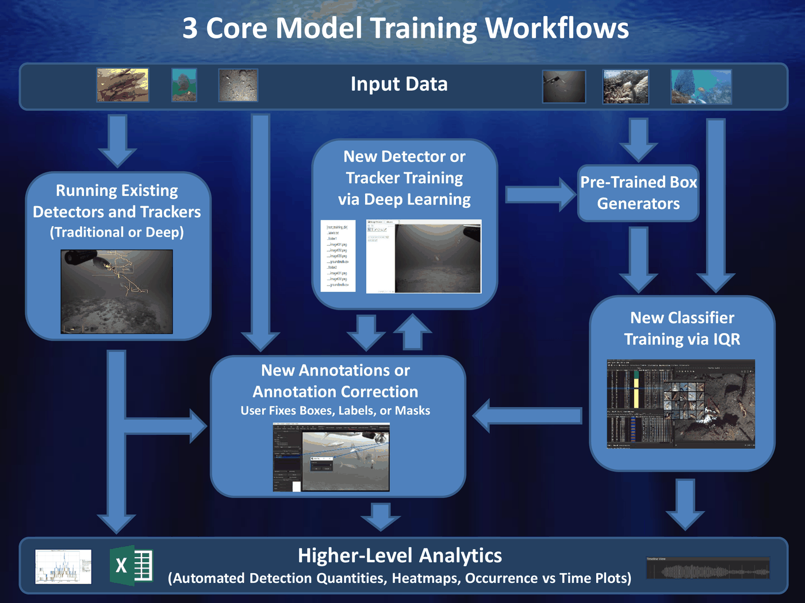

==========================
Model Generation Workflows
==========================

There are several routes from raw imagery to a working model in VIAME. They differ
mainly in how much annotation the user does by hand, and in how good the resulting model
can become. They are not exclusive: most projects start with a quick route and move
towards the first workflow as annotations accumulate.

**********
Comparison
**********

.. list-table::
   :header-rows: 1

   * - Workflow
     - Annotation effort
     - Data needed
     - Resulting model
   * - Deep learning from scratch
     - Highest, every object is drawn by hand
     - Hundreds of examples per class
     - Best, given enough data
   * - Deep learning with partial automation
     - Moderate, the user corrects what a detector proposes
     - Hundreds of examples per class
     - Same as above, reached sooner
   * - IQR (video search with adjudication)
     - Low, the user accepts or rejects results
     - A few examples to start
     - Good for the amount of data, below a well trained deep model
   * - Text queries
     - Low, the user types a description and corrects the results
     - None to begin
     - Initial annotations rather than a model

**************************************
Workflow 1: Deep Learning from Scratch
**************************************

1. Load up imagery in annotator
2. Annotate imagery manually
3. Export detection or tracks files
4. Repeat for as many sequences as possible in diverse backgrounds
5. Run model training
6. Evaluate model performance
7. Repeat steps 4 thru 6 as desired on detector fail cases, focusing additional
   annotation on sequences with the most errors

**Pros:**

- Models perform better than most other solutions when trained with enough training
  data.
- The annotations are made to the user's own definition of each class, with no bias from
  an existing detector.
- The same annotations can be reused to train any detector, tracker or classifier later.

**Cons:**

- Requires a large amount of training data and user time to generate it.
- Performance is poor until enough examples of each class exist, so rare classes lag
  behind common ones.
- Needs a GPU for every detector other than the SVM.

Use this when accuracy matters most and annotation time is available, or when no
existing detector finds the objects at all. See `detector
training <https://viame.readthedocs.io/en/latest/sections/object_detector_training.html>`__.

*************************************************
Workflow 2: Deep Learning with Partial Automation
*************************************************

1. Load up imagery in annotator
2. Run an automated detector (can be IQR based, default model, other pre-trained
   detector, or user generated deep detector)
3. Correct and export detection or tracks files
4. Repeat for as many sequences as desired in diverse backgrounds
5. Run model training
6. Evaluate model performance
7. Repeat steps 2 thru 6 as desired on detector fail cases

**Pros:**

- Can speed up annotation if automated detector is decent enough.
- Each retrained model makes the next round of annotation faster, since there is less to
  correct.
- Reviewing detector output shows where the model fails, which points to the imagery
  worth annotating next.

**Cons:**

- If automated detector is poor it can take more effort to correct automated outputs
  instead of doing annotations from scratch.
- Objects the detector misses are easy to overlook during review, so its blind spots can
  carry over into the next model.
- Box placement follows the detector's habits, which may differ from how the user would
  have drawn them.

Use this once any detector finds most of the objects of interest, including a generic
one that only proposes boxes without naming the species. See `object
detection <https://viame.readthedocs.io/en/latest/sections/object_detection.html>`__.

******************************************
Workflow 3: IQR for Rapid Model Generation
******************************************

IQR (iterative query refinement) is video search with adjudication. The user gives an
example of what they are looking for, and then accepts or rejects the results the system
returns. A simple model is trained from those answers.

1. Create searchable index for a video archive (either at full frame level, detection
   level on top of pre-trained detectors, or track level)
2. Launch search GUI
3. Use search GUI to generate IQR (.svm) models
4. Save models to category directory
5. Evaluate models

**Pros:**

- Can be done with very little user effort, mostly computer runtime.
- Can be used to rapidly generate models for new classes.
- The resulting SVM models train and run on a CPU.

**Cons:**

- GUI generally crashes after about 6 iterations due to memory issues.
- Models generally not as good as deep models trained on enough training data (but can
  be better for cases with not a lot of training data).
- The archive has to be indexed before searching, which takes computer time up front.
- When the index is built on detections, a model can only find objects the underlying detector proposed a box for.

Use this for a new class with few examples, or to find rare objects in a large archive.
Its results can also be corrected and used as annotations for the first two workflows.
See `video and image
search <https://viame.readthedocs.io/en/latest/sections/search_and_rapid_model_generation.html>`__.

*********************************************
Workflow 4: Text Queries for Rapid Annotation
*********************************************

A text query finds objects from a description in words, such as "fish" or "sea turtle".
It needs no annotations, no index and no trained model, so it is the quickest way to get
a first set of annotations on new imagery. It is best seen as a faster start to the
second workflow than as a way to produce a final model.

1. Load up imagery in annotator
2. Run a text query pipeline, giving a description of the objects
3. Correct the results and assign the classes of interest
4. Export detection or tracks files
5. Run model training on the corrected annotations
6. Evaluate model performance

**Pros:**

- Nothing has to exist beforehand: no annotations, index or trained detector.
- SAM3 queries return masks and tracks as well as boxes, which are the slowest
  annotations to draw by hand.
- A vision-language model accepts longer descriptions, which helps pick out objects by
  appearance or behaviour.

**Cons:**

- Works best for categories that can be named simply. Telling apart similar species
  usually still needs a trained model.
- Slower per frame than a trained detector, and SAM3 requires a GPU.
- Vision-language model results carry no confidence, so they cannot be filtered by a
  threshold and all need review.
- Depends on an add-on or a separately served model being installed.

Use this at the start of a project, or for a new class that no detector covers. Once the
corrected annotations are trained into a standard detector, that detector is faster and
more accurate on the same imagery than the text query that started it. See `text query
and VLM <https://viame.readthedocs.io/en/latest/sections/text_query_and_vlm.html>`__.

*******************
Choosing a Workflow
*******************

.. list-table::
   :header-rows: 1

   * - Situation
     - Suggested start
   * - New imagery, nothing annotated yet
     - Text queries, then correct and train
   * - A detector already finds most of the objects
     - Partial automation
   * - A rare object in a large archive
     - IQR
   * - A handful of examples of a new class
     - IQR, or the SVM trainer
   * - Hundreds of annotations per class available
     - Deep learning, from scratch or with partial automation
   * - Existing detectors find nothing useful
     - Deep learning from scratch

Whichever route is taken first, the corrected annotations it produces can be fed into
detector training. As the number of annotations per class grows, retraining with a deep
detector gives the largest gain in accuracy.
