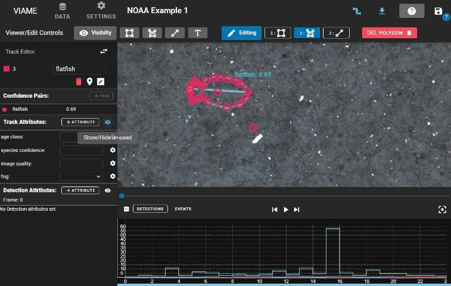
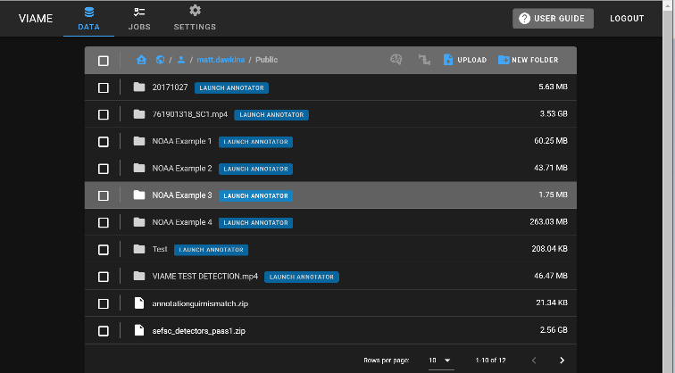
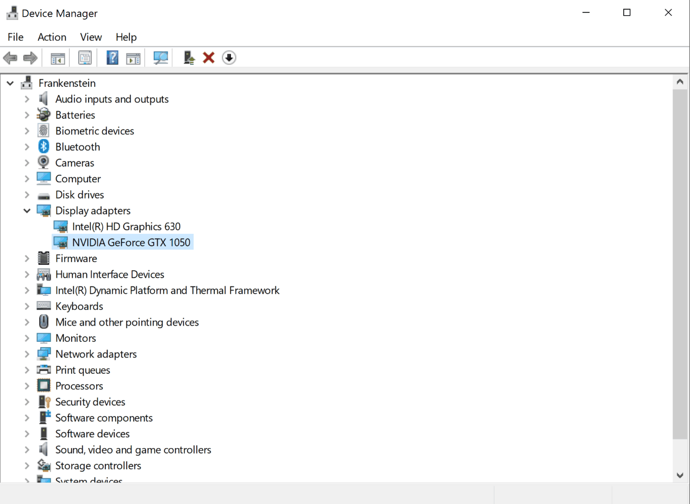
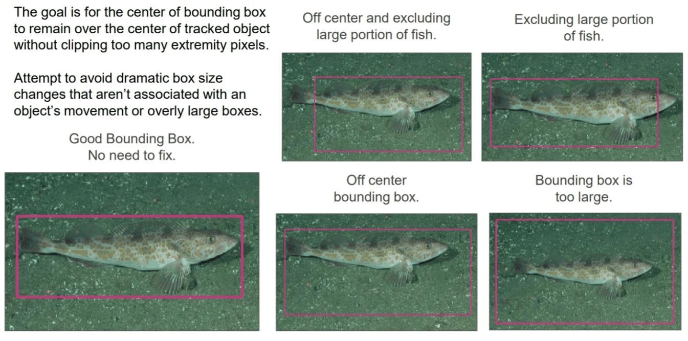
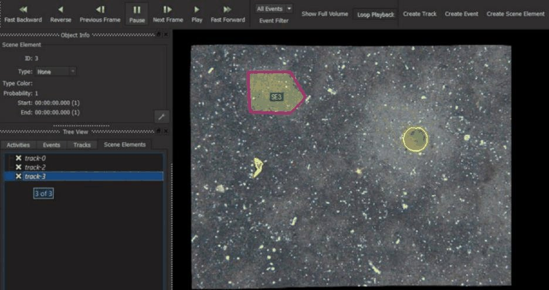

=======================
Quick-Start Guide
=======================

VIAME (Video and Image Analytics for Multiple Environments) is a do-it-yourself AI system
for analyzing imagery and video, primarily targeting marine species analytics but also
useful as a general computer vision toolkit.

***************
Important Links
***************

.. |br| raw:: html

    

.. rst-class:: link-list

- **Main website:** https://www.viametoolkit.org/
- **Manual:** https://viame.github.io/VIAME/
- **GitHub:** https://github.com/VIAME/VIAME
- **Bug reporting:** https://github.com/VIAME/VIAME/issues |br|
  https://github.com/Kitware/DIVE/issues
- **Additional Discussion:** https://discourse.kitware.com/c/viame-dive
- **Tutorial videos:** https://www.youtube.com/channel/UCpfxPoR5cNyQFLmqlrxyKJw
- **Additional Help Contact:** viame-web@kitware.com

There are 5 types of documentation: this quick-start guide, tutorial videos, user forums,
example readmes, and the full manual. Installers (pre-built binaries), docker images, and
source code are hosted on GitHub. Pre-built binaries are for users, while the source code
and build instructions are for developers.

***************
VIAME Flavors
***************

VIAME comes in a few different interfaces with slightly different capabilities. Not listed
in this document thoroughly are programming APIs for developers.

DIVE -- Web and Desktop Annotator
==================================

Originally created as the VIAME-Web interface (with a public server hosted at
https://viame.kitware.com), a desktop version of this web annotator and model trainer
is also available in both Windows .msi installers and .zip release formats.

This tool is currently the most general purpose annotator, and supports polygons, lines,
points, or boxes, and can train models over multiple videos or image sequences using
standard models.

Command Line Interface
=======================

Everything VIAME does can be run from a terminal through the ``viame`` command, which suits
batch processing, scripted workflows and machines without a display. See the `command line
interface <https://viame.github.io/VIAME/sections/command_line_interface.html>`__ page for
its commands.

Project Files
==============

Project files are a collection of scripts targeting either groups of images or videos. They
are documented later on in this guide. Project files are also used to launch some of the
annotation GUIs in the desktop version of the software, or to train models across multiple
sequences headless (without a GUI) to prevent the GUI from using any system resources while
training, e.g. VRAM, reserving more for the training process.

Example Folders
================

In the "examples" folder of a VIAME install are a series of standalone .bat (Windows) or
.sh (Linux) launchers broken down based on functionality covering all aspects of the system.

Deprecated Interfaces
======================

Three older desktop tools remain in the installers for a few specialized cases, but are no
longer developed now that DIVE covers what they do:

- **VIEW:** the original C++ annotator for boxes and polygons, still quick on very high resolution imagery
- **SEARCH:** standalone image and video search, refined by feedback on the results
- **SEAL:** box annotation across 2 to 4 camera views side by side

*****************************
Capabilities Breakdown
*****************************

.. role:: y
.. role:: p
.. role:: n

.. |Y| replace:: :y:`Y`
.. |P1| replace:: :p:`P¹`
.. |P2| replace:: :p:`P²`
.. |P3| replace:: :p:`P³`
.. |P4| replace:: :p:`P⁴`
.. |P5| replace:: :p:`P⁵`
.. |N| replace:: :n:`N`

.. rst-class:: cap-legend

:y:`Y` Supported :p:`P` Partial :n:`N` Not supported

.. rst-class:: cap-table

============================================== ======== ============= ============ ============ ========
Feature                                        Examples Project Files Command Line DIVE Desktop DIVE Web
============================================== ======== ============= ============ ============ ========
**Platform**
Included in the desktop installers             |Y|      |Y|           |Y|          |Y|          |N|
Runs in a web browser from a remote server     |N|      |N|           |N|          |N|          |Y|
Runs without a display, for batch scripts      |Y|      |Y|           |Y|          |N|          |P1|
Docker images provided                         |Y|      |Y|           |Y|          |N|          |Y|
**Annotation**
Boxes, polygons, keypoints and lines           |P2|     |P2|          |N|          |Y|          |Y|
Point-click segmentation                       |N|      |N|           |N|          |Y|          |P3|
Multi-camera and stereo annotation             |N|      |N|           |N|          |Y|          |Y|
Tiled large images (GeoTIFF)                   |N|      |N|           |N|          |Y|          |Y|
Review grid across datasets                    |N|      |N|           |N|          |Y|          |Y|
**Processing**
Detection and tracking pipelines               |Y|      |Y|           |Y|          |Y|          |Y|
Stereo measurement pipelines                   |Y|      |N|           |Y|          |Y|          |Y|
Interactive stereo measurement                 |N|      |N|           |N|          |Y|          |P3|
Image and video search with refinement         |Y|      |Y|           |Y|          |Y|          |N|
Text query                                     |Y|      |N|           |Y|          |Y|          |N|
Image enhancement output                       |Y|      |N|           |Y|          |Y|          |Y|
Registration and mosaicing                     |Y|      |Y|           |Y|          |P4|         |P4|
Scoring and evaluation                         |Y|      |N|           |Y|          |Y|          |Y|
Annotation format conversion                   |Y|      |N|           |Y|          |Y|          |Y|
**Training**
Detector training over multiple sequences      |Y|      |Y|           |Y|          |Y|          |Y|
Frame classifier training                      |Y|      |N|           |Y|          |Y|          |Y|
Tracker training                               |Y|      |N|           |Y|          |Y|          |Y|
Add-on model pack downloads                    |N|      |N|           |Y|          |Y|          |P5|
============================================== ======== ============= ============ ============ ========

.. rst-class:: cap-notes

| ¹ Through the REST API
| ² Launches DIVE
| ³ Smaller models, run in the browser
| ⁴ Registration only, no mosaic output
| ⁵ Server administrators only

*************************************
GPU vs CPU Installations
*************************************

VIAME is designed to run on 8 Gb+ VRAM NVIDIA Graphics cards (1 or more), but:

- Many algorithms can run with less and a generic 4 Gb patch is available on the install page
- Also depends on if talking about just inference (pre-trained model running, uses less) or training
- This is just for algorithms and processing pipelines; annotation GUIs can be run on CPU

Additionally:

- Some algorithms are meant to run on CPU (motion tracker, baseline pixel classification)
- Some algorithms are meant to run on GPU, but can run on CPU (deep frame classification)
- Some are designed for GPU, and can run on but take forever on CPU (most deep CNN detectors, many deep learning training routines)

How do I know if I have a GPU?
===============================

On Windows, look in Device Manager. Sometimes computers have more than one card (one embedded
on the motherboard, then a 2nd in a plugin slot). Next, search for the card to know its
specifications. On Linux, many terminal commands can tell you which GPU you have (e.g.
``nvidia-smi``, ``lspci | grep -i nvidia``).

*************************************
Types of Annotation and Detection Models
*************************************

There are four main types of annotations and detection models:

.. list-table::
   :widths: 50 50

   * - .. image:: ../_static/images/quickstart_annotation_box_level.jpg
    :alt: Annotation box level
          :width: 100%

       **Box-Level:** A bounding box around the object of interest.
     - .. image:: ../_static/images/quickstart_annotation_frame_level.jpg
    :alt: Annotation frame level
          :width: 100%

       **Frame-Level:** The entire frame is classified (e.g. the whole image has a label).
   * - .. image:: ../_static/images/quickstart_annotation_pixel_level.jpg
    :alt: Annotation pixel level
          :width: 100%

       **Pixel-Level:** Pixel masks or polygons tracing the exact outline of objects.
     - .. image:: ../_static/images/quickstart_annotation_keypoints.jpg
    :alt: Annotation keypoints
          :width: 100%

       **Keypoints:** Specific points of interest on objects (e.g. head, tail).

Detections vs Tracks
======================

Detections and tracks are synonymous across examples and user interfaces. A track is a
(temporal) sequence of single-frame detections, but a detection can also be viewed as a
track with just a single state.

.. list-table::
   :widths: 50 50

   * - .. image:: ../_static/images/quickstart_detection_example.jpg
    :alt: Detection example
          :width: 100%

       Detection
     - .. image:: ../_static/images/quickstart_track_example.jpg
    :alt: Track example
          :width: 100%

       Track

*************************************
Annotation Formats
*************************************

For details on annotation file formats, see the
`Detection File Formats <https://viame.github.io/VIAME/sections/detection_file_formats.html>`_
section.

**VIAME-CSV** is the primary input/output format supported by default, with a single line
for either each detection, or each detection state in a track. It has 9 required fields
comma separated, with optional additional columns for keypoints, attributes, polygons,
and masks.

**COCO JSON** adaptation is also supported by some GUIs, with added track support.

Annotation Best Practices
==========================

When creating bounding box annotations:

- The goal is for the center of bounding box to remain over the center of the tracked object without clipping too many extremity pixels
- Attempt to avoid dramatic box size changes that aren't associated with an object's movement or overly large boxes
- Need to consider efficiency (time) vs quality tradeoffs when deciding to do boxes vs pixel masks, box quality, keypoints + boxes, etc.

****************************
Model Generation Workflows
****************************

There are several routes from raw imagery to a working model, from annotating everything by
hand to searching by text or example. See `model generation workflows
<https://viame.github.io/VIAME/sections/model_generation_workflows.html>`__ for the steps of each and how they compare.
