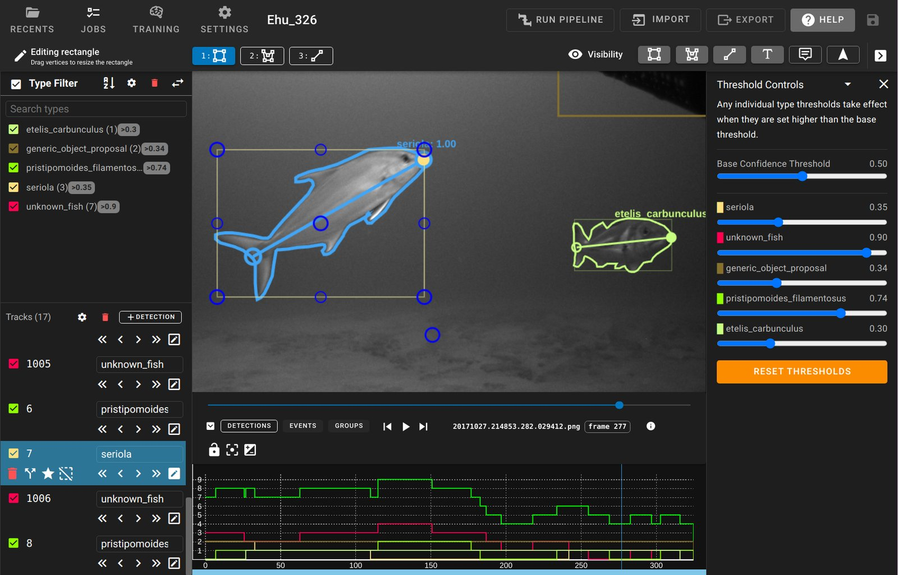

# User Interfaces

This document corresponds to the [user interfaces](https://github.com/VIAME/VIAME/blob/main/examples/user_interfaces) example folder within a VIAME desktop installation. VIAME can be driven through several interfaces, summarized below. Each has its own section of the manual with the details.

## DIVE Interface

DIVE is the recommended graphical interface, available on the desktop and on the web. It is used to annotate multiple image sequences or videos, train models across them, and run the trained models on new data. It is launched with the `launch_dive_interface` script, in this folder or at the top level of the installation.

See the [DIVE interface guide](https://viame.github.io/VIAME/sections/dive/index.html), and [interactive annotation](https://viame.github.io/VIAME/sections/interactive_annotation.html) for segmenting objects by clicking on them.

## Python Interface

`pip install viame` provides the `viame` python package, which the command line tool is itself built on. Images, videos, annotations and pipelines can be loaded and run directly from python.

See the [python interface](https://viame.github.io/VIAME/sections/python_interface.html).

## Project Folders

Project folders are ready-made working folders holding launch scripts for the common tasks: annotating, running detectors and trackers, and training models. One is copied to a working drive outside the installation, the input data is placed in it, and the scripts are run from there.

See [project folders](https://viame.github.io/VIAME/sections/project_folders.html).

## Command-Line Interface

The `viame` command runs pipelines, trains and scores models, converts files and manages search indexes, without a graphical interface. It suits batch processing, remote machines and scripted workflows.

The [command line interface guide](https://viame.github.io/VIAME/sections/command_line_interface.html) lists every command, with worked examples of the common tasks.

### Scripts in this folder

Standalone utility scripts in this folder include the following. Each of these is designed to take in a folder of videos, folder of images, or a folder of folders of images, see default [input folder structure](https://viame.github.io/VIAME/sections/examples_overview.html#bulk-processing-scripts).

- draw_detections_on_frames - Draw detections stored in some detection file onto frames
- extract_chips_from_detections - Extract image chips around detections or truth boxes
- extract_frames - Extract all frames in videos in the input folder
- extract_frames_with_dets_only - Extract frames with detections only in the input

### Simple Pipeline UIs

Lastly, there are additionally simpler GUIs which can be enabled in .pipe files.

For directly running and editing pipeline files, see the [KWIVER documentation](https://kwiver.readthedocs.io/en/latest/).

One example of this is the 'simple_display_pipeline'. This script launches a pipeline containing an OpenCV-based display window, which prints out detections as they are being processed by the pipeline.

## Deprecated Desktop UIs

Three desktop interfaces predate DIVE. They remain available for a few specialized cases but are no longer developed, and DIVE is recommended for new work.

- VIEW - original annotator for boxes and polygons on a single sequence, fast on very large imagery. See the [VIEW interface](https://viame.github.io/VIAME/sections/view_interface.html) guide.
- SEARCH - standalone image and video search. See [video and image search](https://viame.github.io/VIAME/sections/search_and_rapid_model_generation.html).
- SEAL - box annotation across two to four camera views side by side.
